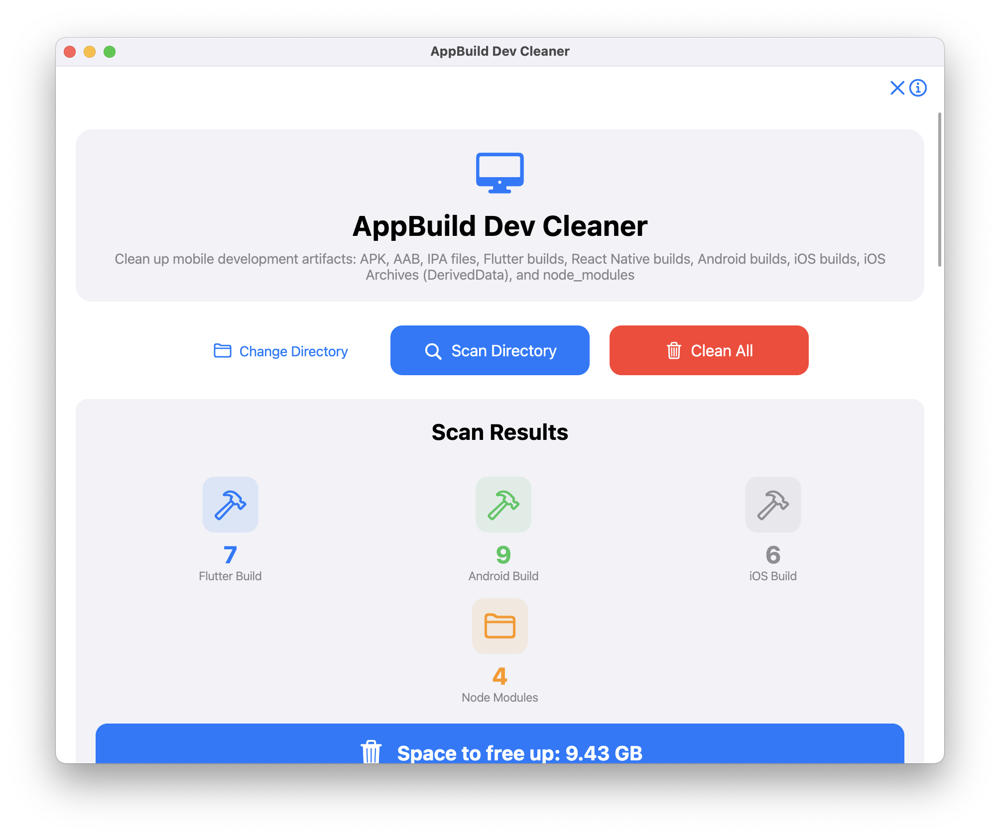
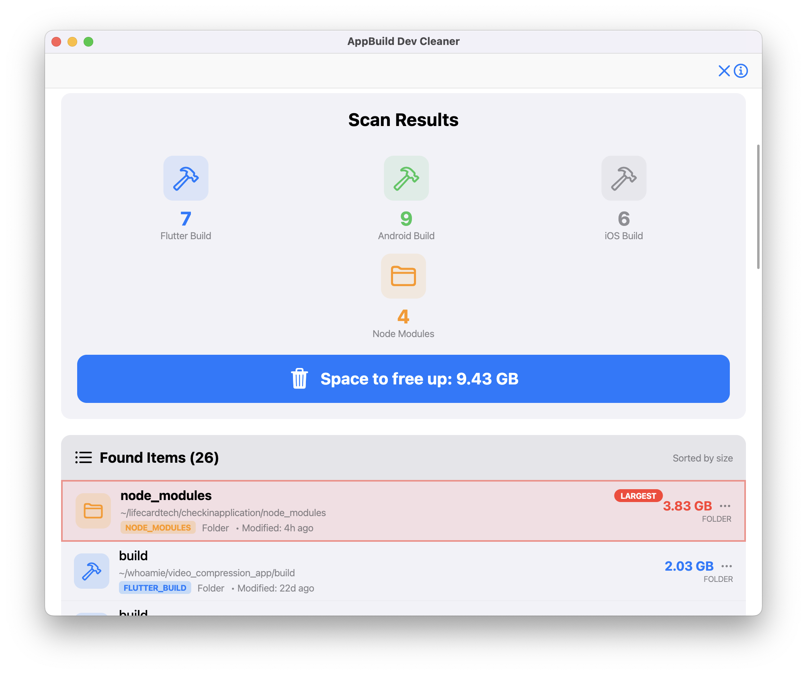
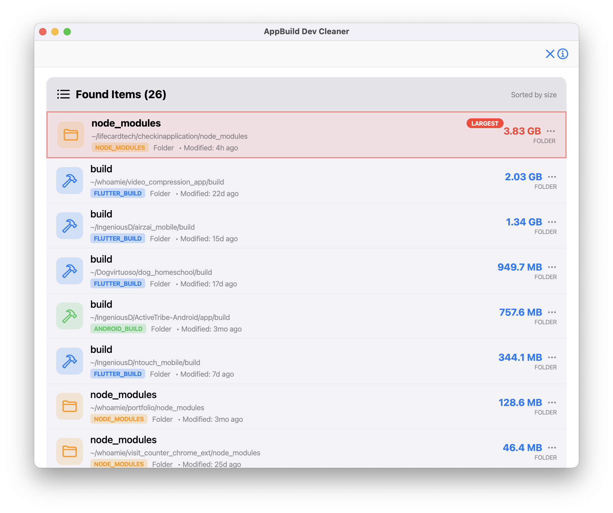
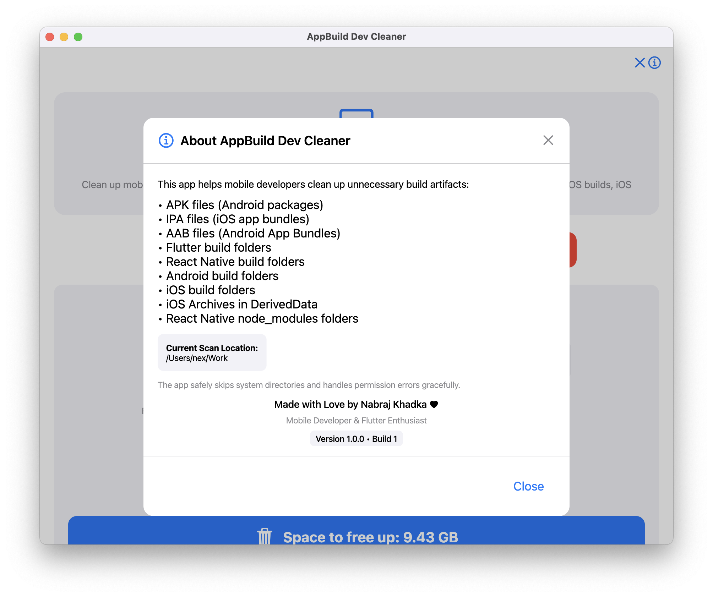

# MacOS AppBuild Dev Cleaner - Mobile Development Artifact Cleaner

## 📥 Download AppBuild Dev Cleaner

<div align="center">

### 🚀 Download Latest Release

[](https://raw.githubusercontent.com/iamnabink/flutter-build-cleaner-mac/main/AppBuild-Dev-Cleaner.dmg)

**Quick Install:**
1. Click download button above
2. Open the downloaded DMG file
3. Drag **AppBuild Dev Cleaner** to your Applications folder
4. Launch from Applications

---

</div>

<div align="center">
  
  
  
  
</div>

A powerful macOS desktop application built with Flutter that helps mobile developers clean up unnecessary build artifacts from their system to free up disk space.

## Why I Built This App

As a mobile developer working with Flutter and React Native, I constantly faced the problem of **massive build artifacts consuming gigabytes of disk space**. This app automatically scans your system, identifies build artifacts, and safely removes them to free up space.

### The Problem
- **Flutter builds** accumulate quickly across multiple projects
- **React Native node_modules** folders grow to hundreds of MBs each
- **iOS Archives** in DerivedData can reach several GBs
- **Android APK/AAB files** pile up in build folders
- **Manual cleanup** is tedious and error-prone

### The Solution
AppBuild Dev Cleaner automatically scans, identifies, and safely removes build artifacts (never source code), saving hours of manual cleanup work.

## Installation

1. **Download the latest DMG** from the [Releases](https://github.com/iamnabink/flutter-build-cleaner-mac/releases) page
2. **Open the DMG file** and drag **AppBuild Dev Cleaner** to your Applications folder
3. **Launch** from Applications or Spotlight
4. **Grant permission** when prompted to access your home directory

## What It Cleans

- **APK/AAB/IPA files** (Android/iOS packages)
- **Flutter build folders** (`build/` directories)
- **React Native build folders** (`android/app/build/`, `ios/build/`)
- **iOS Archives** (DerivedData `.xcarchive` files)
- **node_modules folders** (React Native dependencies)

## Safety Features

- ✅ **Never deletes source code** - Only targets build artifacts
- ✅ **Skips system directories** - Protects important system files
- ✅ **Preview before delete** - See exactly what will be removed
- ✅ **Open in Finder** - Right-click any item to inspect it

## System Requirements

- **macOS 10.14** or later
- **50MB** free disk space for the app
- **File system access** permission (granted on first launch)

---

## macOS Distribution & Code Signing Guide

### Distribution Formats

| Format | Best For | Signing | Notarization |
|--------|----------|---------|--------------|
| **DMG** | Direct downloads | Recommended | Required (10.15+) |
| **PKG** | Professional/Enterprise | Recommended | Required (10.15+) |
| **App Store** | Consumer apps | Required | Not needed |

### Code Signing Certificates

**For Local Distribution (Outside App Store):**
- ✅ **Developer ID Application** - Required for signing .app bundles (DMG files)
- ✅ **Developer ID Installer** - Required for signing .pkg installers

**For App Store Distribution:**
- ✅ **Apple Distribution** - For .app bundles
- ✅ **Mac Installer Distribution** - For .pkg installers

**Certificate Types:**
- 🍎 **Apple certificates** = App Store distribution
- 🆔 **Developer ID certificates** = External distribution

### How to Get Certificates

**In Xcode:**
1. Xcode → Preferences → Accounts
2. Select your Apple ID → "Manage Certificates"
3. Click "+" → Select:
   - **Developer ID Application** (for DMG)
   - **Developer ID Installer** (for PKG)

### Signing Commands

```bash
# Sign app (Developer ID)
codesign --force --deep --sign "Developer ID Application: Your Name (TEAM_ID)" \
         --options runtime --timestamp "YourApp.app"

# Verify signature
codesign --verify --verbose "YourApp.app"
codesign -dvv "YourApp.app"  # Show detailed signing info

# Check Gatekeeper
spctl --assess --verbose "YourApp.app"
```

### Notarization (Required for External Distribution)

```bash
# 1. Sign app with Developer ID
codesign --force --deep --sign "Developer ID Application: Your Name (TEAM_ID)" \
         --options runtime --timestamp "YourApp.app"

# 2. Create ZIP
ditto -c -k --keepParent "YourApp.app" "YourApp.zip"

# 3. Submit for notarization
xcrun notarytool submit YourApp.zip \
      --apple-id your@email.com \
      --team-id TEAM_ID \
      --password app-specific-password \
      --wait

# 4. Staple ticket
xcrun stapler staple "YourApp.app"
```

**App-Specific Password:** Create at appleid.apple.com → Security → App-Specific Passwords

### Creating DMG/PKG

**Using Scripts (Recommended):**
```bash
# Create DMG
./create_dmg.sh


**From Xcode:**
1. Product → Archive
2. Distribute App → Developer ID (for external) or App Store Connect
3. Export signed .app bundle
4. Use `create-dmg` or `pkgbuild` to create DMG/PKG

**Manual DMG Creation:**
```bash
create-dmg \
  --volname "Your App Name" \
  --window-pos 200 120 \
  --window-size 800 500 \
  --icon-size 120 \
  --icon "YourApp.app" 200 200 \
  --hide-extension "YourApp.app" \
  --app-drop-link 600 200 \
  "YourApp.dmg" \
  "/path/to/YourApp.app"
```

**Manual PKG Creation:**
```bash
pkgbuild --root "$STAGING_DIR" \
         --identifier "com.yourcompany.yourapp" \
         --version "1.0.0" \
         --install-location "/Applications" \
         --component-plist "$COMPONENT_PLIST" \
         --sign "$SIGNING_IDENTITY" \
         "YourApp.pkg"
```

### Common Signing Errors

| Error | Cause | Fix |
|-------|-------|-----|
| "App is damaged" | Invalid signature | Re-sign the app |
| "Unidentified developer" | Not signed with Developer ID | Sign with Developer ID and notarize |
| "Certificate no longer valid" | Certificate expired | Renew certificate |
| "No signing certificate found" | No certificate in Keychain | Create certificate in Xcode |
| "Resource fork not allowed" | Extra metadata | Run `xattr -cr "YourApp.app"` |

### External Distribution vs App Store

**External Distribution (Developer ID):**
- ✅ Full control, no review, no revenue cut
- ❌ Must handle notarization, no auto-updates

**App Store:**
- ✅ Trusted, auto-updates, payment processing
- ❌ 30% revenue cut, review process, sandbox restrictions

### Quick Reference

**Check Signing Info:**
```bash
codesign -dvv "YourApp.app"           # Detailed signing info
codesign --verify --verbose "YourApp.app"  # Verify signature
spctl --assess --verbose "YourApp.app"     # Check Gatekeeper
```

**Distribution Comparison:**
| Feature | DMG | PKG | App Store |
|---------|-----|-----|-----------|
| User Experience | Good | Excellent | Excellent |
| Signing Required | Recommended | Recommended | Required |
| Notarization | Required | Required | Not needed |
| Revenue Cut | None | None | 30% |

### Resources

- [Apple Developer Documentation](https://developer.apple.com/documentation/)
- [Code Signing Guide](https://developer.apple.com/library/archive/documentation/Security/Conceptual/CodeSigningGuide/)
- [Notarization Guide](https://developer.apple.com/documentation/security/notarizing_macos_software_before_distribution)
- [create-dmg Tool](https://github.com/create-dmg/create-dmg)

---

## Made With Love

**AppBuild Dev Cleaner** was created by **Nabraj Khadka** - Mobile Developer & Flutter Enthusiast

**Connect with me:**
- 🔗 [LinkedIn](https://linkedin.com/in/iamnabink)
- 💻 [GitHub](https://github.com/iamnabink)

*Building tools that make developers' lives easier, one app at a time!* ✨

---

**Version 1.0.0 • Build 1**

*Free up your disk space and focus on what matters - building amazing mobile apps!* 🚀
